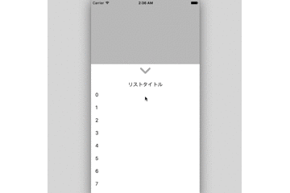

# KkListActionSheet
The library is like an extension of the tableview to ActionSheet.


## Demo


## Requirement
* iOS 6.0+
* ARC

## Install
There are two ways to use this in your project:

* Copy KkListActionSheet directory into your project

* Install with CocoaPods to write Podfile

```
pratform :ios
pod 'KkListActionSheet'
```

## Usage
### setDelegate
KkListActionSheet uses a simple methodology. import header file and It defines a delegate(contains datasource)
, its client implement. KkListActionSheetDelegate are like the combined UITableViewDelegate and UITableViewDatasource.

#### Show Position
```
+ (instancetype) createInit:(UIViewController *) parent;
```
or
```
+ (instancetype) createInit:(UIViewController *) parent style:(int) styleIdx;
```

**style Pattern in portrait**
* DEFAULT : about 60 percent in screen height
* MIDDLE  : screen height half
* LOW     : about 30 percent in screen height

**style Pattern in Landscape**
* DEFAULT : about 60 percent in screen height
* MIDDLE & LOW : screen height half

#### show KkListActionSheet
```[kkListActionSheet showHide]```

#### hidden ListTitle
```
- (void) setHiddenTitle;
```

#### set ListTitle
```
- (void) setTitle:(NSString *)title;
```
or
```
- (void) setAttrTitle:(NSAttributedString *)attrTitle;
```

### example
* import kkListActionSheet.h
* implement KkListActionSheetDelegate and Method

```
#import "kkListActionSheet.h"

@interface ExampleViewController ()

<KkListActionSheetDelegate>

@end

@implement ExampleViewController {
  kkListActionSheet *kkListActionSheet;
}

-(void) viewDidLoad {
  kkListActionSheet = [KkListActionSheet createInit:uiViewController];
  kkListActionSheet.delegate = self;
}

-(IBAction)buttonPushed:(UIButton *)sender {
    [kkListActionSheet showHide];
}

@end
```

## Licence
[MIT](https://github.com/kuririnz/KkListActionSheet/blob/develop/LICENSE)

## Author
[kuririnz](https://github.com/kuririnz)
